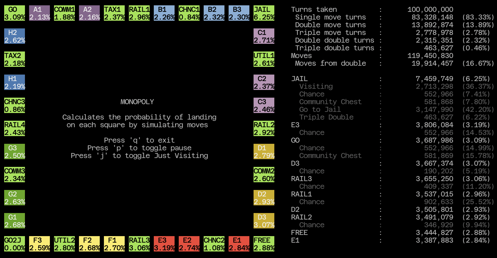

# Monopoly Probabilities #

## WASM version: ##


rust, cargo and wasm-pack need to be installed to build the WASM version.

To build an html directory containing individual assets and open it in the default browser:
```bash
cd monopoly-wasm
./Build.sh
```

To build a stand alone html page (single/index.htm) and open in the default browser:
```bash
cd monopoly-wasm
./BuildSingle.sh
```

## Console version: ##



rust and cargo need to be installed to run this version.

```bash
cd monopoly-tui
cargo run --release
```
