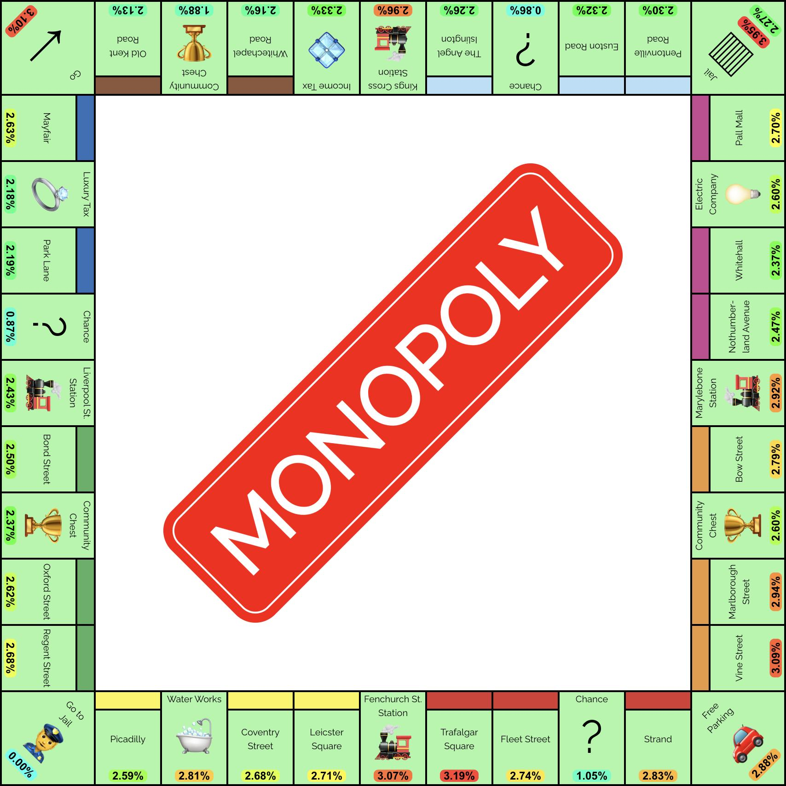
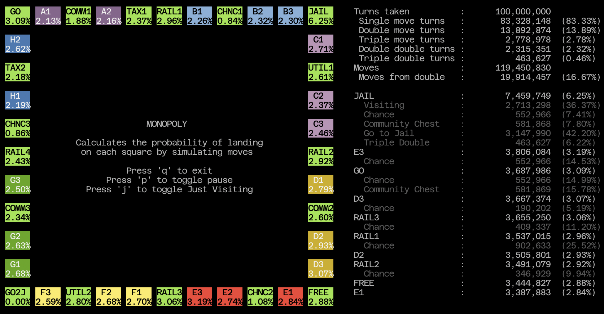

# Monopoly Probabilities

Calculates how often each square on a Monopoly board is landed on, both by simulating games and exactly using
Markov chain transition matrices and their steady state. Results are given for both ways of getting out of jail:
paying immediately, or waiting and rolling for doubles.

There are three front ends:

- A WASM web page that runs a simulation and compares it with the calculated probabilities
  ([live page](https://andywarduk.github.io/monopoly/))
- A console (TUI) simulation
- A calculator that writes the probability matrices to CSV files and a spreadsheet

## Prerequisites

- Rust 1.89 or later (with cargo)
- For the WASM version:
  - The WASM target: `rustup target add wasm32-unknown-unknown`
  - [wasm-pack](https://rustwasm.github.io/wasm-pack/). It downloads wasm-bindgen and binaryen on first use.
  - `python3`, to serve the html directory when using `-o` without `-s`

Run the scripts below from the root of the repository.

## WASM version



```bash
./wasm.sh
```

With no options this builds a standalone page in `monopoly-wasm/index.html` and opens it in the default browser
(the same as `./wasm.sh -s -o`).

| Option | Effect                                                                                                                                            |
| ------ | ------------------------------------------------------------------------------------------------------------------------------------------------- |
| `-s`   | Build a standalone single page in `monopoly-wasm/index.html`. Without it, an html directory of individual assets is built in `monopoly-wasm/html` |
| `-o`   | Open the result in the default browser. The html directory is served on http://127.0.0.1:8000/ using `python3`                                    |

### Updating the live page

```bash
./build_ghpage.sh
```

This builds the web page and copies it to `.github/ghpage`. Pushing to `main` deploys it to GitHub Pages.

## Console version



```bash
./tui.sh
```

| Option         | Effect                                    |
| -------------- | ----------------------------------------- |
| `-w`, `--wait` | Roll to get out of jail instead of paying |

## Probability matrices

```bash
./stats.sh
```

| Option           | Effect                                                               |
| ---------------- | -------------------------------------------------------------------- |
| `-a`, `--dp <N>` | Decimal places of accuracy for the steady state, 1 to 15 (default 8) |
| `-d`, `--debug`  | Print debugging messages                                             |

The results are written to `probabilities.xlsx` and a `csv` directory in the current directory. CSV files starting
`pay_` are for the pay strategy and `wait_` for the roll for doubles strategy. Files ending `_frac` contain
fractions and `_flt` decimals.

| File                                                           | Contents                                                                |
| -------------------------------------------------------------- | ----------------------------------------------------------------------- |
| `*_space.csv`                                                  | Steady state probability by board space                                 |
| `*_set.csv`                                                    | Steady state probability by property set                                |
| `*_steady.csv`                                                 | Steady state vector for every state                                     |
| `*_move_*.csv`                                                 | Dice movement transition matrix                                         |
| `pay_frac.csv`, `pay_flt.csv`, `wait_frac.csv`, `wait_flt.csv` | Combined movement and jump transition matrix                            |
| `*_reason.csv`                                                 | Arrival probability by move reason                                      |
| `jump_*.csv`                                                   | Jump transition matrix (cards and go to jail, same for both strategies) |

## Tests

```bash
cargo test --workspace
```

## Credits

[Probabilities in the Game of Monopoly - Truman Collins](http://www.tkcs-collins.com/truman/monopoly/monopoly.shtml)

[Exploring strategies in Monopoly using Markov chains and simulation - Albert Nilsson](https://www.diva-portal.org/smash/get/diva2:1471765/FULLTEXT01.pdf)

## Disclaimer

MONOPOLY is a trademark of Hasbro. This project is not affiliated with or endorsed by Hasbro.
